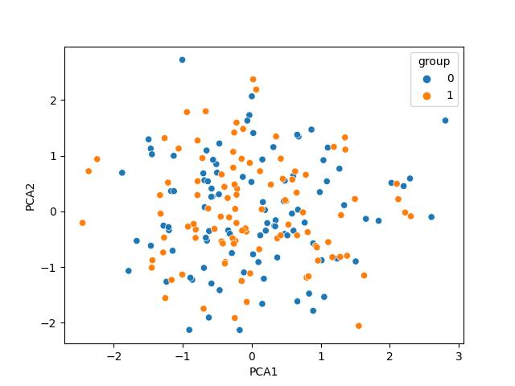
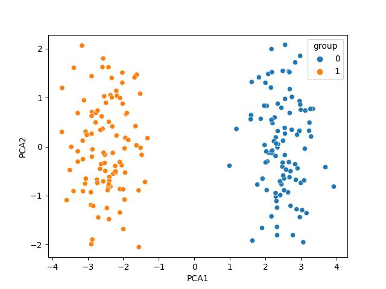
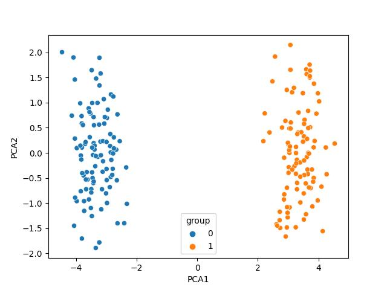

# Population Divergence Simulation and PCA Visualization

This project simulates the divergence of populations over multiple generations and visualizes the population changes using Principal Component Analysis (PCA) with simulated SNP data.

## Overview

The simulation starts with a initial population of individuals, each characterized by their genotypes at various SNPs. The initial population is then split into _k_ sub populations. Over generations, the individuals undergo random breeding, leading to changes in allele frequencies and genotypes. The "randomness" simulates genetic drift, which alters allele frequencies over time. No other evolutionary factors are simulated besides drift. The PCA plots generated at different stages provide insight into how population divergence occurs over time. Built with education in mind, you are encouranged to develop evolutionary intuition by adjusting parameters and observing the corresponding results.

## Key Components

### 1. `generate_population`

- Function: Generates the initial population with specified numbers of individuals and SNPs.
- Input Parameters:
  - `num_individuals`: Number of individuals in the population.
  - `num_snps`: Number of SNPs to consider.
- Output: Returns a numpy array representing the initial population.

### 2. `split_population`

- Function: Splits the population into `k` groups.
- Input Parameters:
  - `population_matrix`: Numpy array representing the population.
  - `k`: Number of groups to split the population into.
- Output: Returns a list of numpy arrays, each representing a group.

### 3. `generate_pca`

- Function: Generates PCA plots for the given population matrices and saves them to files.
- Input Parameters:
  - `population_matrices_lst`: List of numpy arrays representing the populations.
  - `generation_count`: The generation count for which PCA is generated.
  - `directory_path`: Path to the directory to save the plots.

### 4. `sim_breeding`

- Function: Simulates one generation of random breeding and updates genotypes based on allele frequencies.
- Input Parameter:
  - `population_matrix`: Numpy array representing the population.
- Output: Returns a numpy array representing the updated population.

### 5. `sim_main`

- Function: Orchestrates the simulation by iterating over generations, simulating breeding, and generating PCA plots.
- Input Parameters:
  - `generations`: Number of generations to simulate.
  - `num_individuals`: Number of individuals in each population.
  - `num_snps`: Number of SNPs considered.
  - `k`: Number of populations to simulate.
  - `stages`: Stages at which to generate PCA plots.

## Running the Simulation

1. Clone this repository to your local machine.
2. Modify the simulation parameters (e.g., `generations`, `num_individuals`, `num_snps`, `k`) in the `sim_main` function as needed.
3. Run the script to simulate population divergence and visualize the results using PCA.

```python
sim_main(
    generations=100,
    num_individuals=100,
    num_snps=100,
    k=2,
    stages=[50, 100]  # Modify the stages as needed
)

---
```

Generation 0

<br>
Generation 50

<br>
Generation 100

